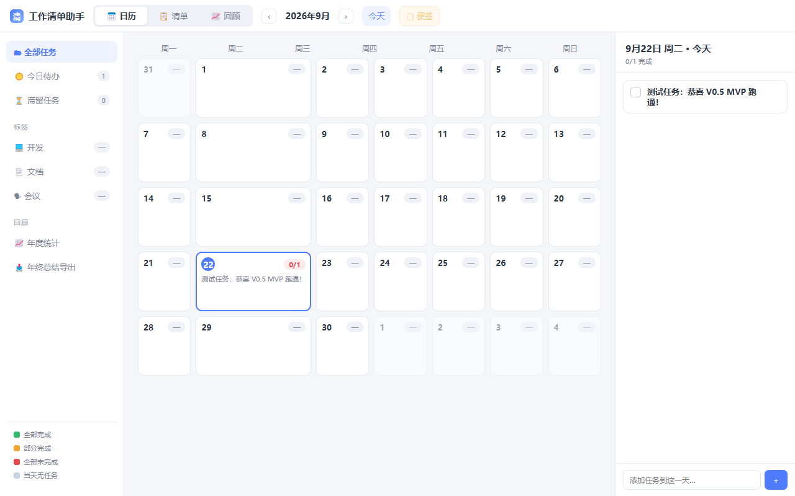

# 工作清单助手（working-log）

> 一款 Windows 单机桌面工作清单应用：日历 + 清单双视图、桌面便签、历史回顾。数据 100% 本地存储，无需登录、无需联网。

  

<!-- 截图占位：发布前补充 screenshots/ 目录截图


-->

## ✨ 功能特性

- **📅 日历视图**：按月浏览，点击日期查看/添加当日任务
- **📋 清单视图**：层级任务（父任务/子任务）、优先级、标签，支持批量管理
- **🗂 双视图切换**：日历与清单一键切换，同一份数据两种视角
- **🗒 桌面便签**：独立置顶便签窗口，「今日待办」自动同步；支持贴边隐藏成小拉手、拖拽换边、位置记忆
- **📈 历史回顾**：日/周/月/年/自定义区间统计，完成率、平均耗时、12 个月趋势图，一键导出 Markdown
- **📌 托盘与快捷键**：最小化到托盘，左键单击快速显隐主界面；`Alt+W` 主界面、`Alt+S` 便签
- **💾 本地 SQLite**：数据存于本机 `%APPDATA%`，无任何云端依赖
- **📦 纯离线单机**：无账号体系、无遥测、无网络请求

> 日期模型：创建/完成日期自动记录，截止日期纯可选 —— 记录你做过什么，而不是逼你计划什么。

## 🛠 技术栈

| 层 | 技术 |
|---|---|
| 桌面壳层 | Tauri 2（Rust） |
| 前端 | Vue 3 + TypeScript + Vite |
| 状态管理 | Pinia |
| UI 组件 | Naive UI |
| 数据库 | SQLite（tauri-plugin-sql，带版本化迁移） |
| 打包 | NSIS 安装包 |

## 🚀 快速开始

### 环境要求

- Node.js ≥ 20
- Rust 工具链（`rustup`，stable-x86_64-pc-windows-msvc）
- MSVC Build Tools（Visual Studio 2019/2022 均可）
- WebView2 运行时（Windows 11 自带）

### 开发运行

```bash
npm install         # 安装前端依赖
npm run tauri dev   # 启动开发模式（首次需编译 Rust，约 5-10 分钟）
```

### 构建安装包

```bash
npm run tauri build   # 产出 NSIS 安装包（src-tauri/target/release/bundle/nsis/）
```

## 📁 项目结构

```
src/                  # Vue 前端（主窗口）
  components/         # CalendarView / ListView / DayPanel / HistoryView
  stores/tasks.ts     # Pinia 任务 store（CRUD + 状态流转 + 跨窗口同步）
  db.ts               # 数据访问层：Tauri 下走 SQLite，纯浏览器 dev 时降级 localStorage
src-tauri/            # Tauri 壳层（Rust）：托盘 / 全局快捷键 / 双窗口 / 数据库迁移
  src/lib.rs          # 应用入口与窗口管理
sticky.html / src/    # 便签窗口多页入口
scripts/gen-icons.mjs # 图标生成器（纯 Node SDF 渲染）：node scripts/gen-icons.mjs
docs/PRD.md           # 产品需求文档
docs/prototype.html   # HTML 高保真原型（可直接浏览器打开）
```

## 🧩 设计说明

- **双模式数据层**：`src/db.ts` 通过 `__TAURI_INTERNALS__` 探测运行环境 —— Tauri 窗口内走 SQLite；纯浏览器打开 `localhost:5173` 时降级 localStorage，方便快速调整 UI
- **双窗口架构**：主窗口 + 无边框置顶便签窗口，通过 Tauri 事件广播 + 轮询兜底保持数据同步
- **图标自生成**：仓库不含二进制图标源文件，`scripts/gen-icons.mjs` 用 SDF 超采样纯 Node 渲染全套 PNG/ICO

## 🗺 Roadmap

- [ ] 回收站（已建表，UI 待接入）
- [ ] 标签管理
- [ ] 重复任务
- [ ] 数据备份 / 导入导出
- [ ] macOS / Linux 支持

## 📄 许可证

[MIT](LICENSE) © 2026
